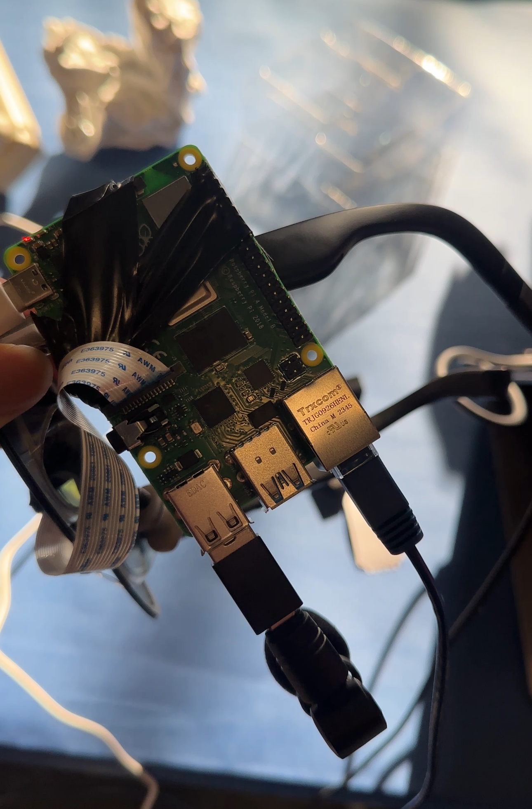

# AR Surgical Guidance Platform
<div>
   <figure>
      
   </figure>
   <figure>
      
   </figure>
</div>

*XREAL One AR Glasses, Raspberry Pi 5, Arducam, Microphone, Electrical Tape*

---

# Contributors
- Co-Developer (Full-stack + Data): <a href="https://www.linkedin.com/in/tylerle-uf/" target="_blank">Tyler Le</a>

- Co-Developer (Full-Stack + Hardware): <a href="https://www.linkedin.com/in/ryan-mago/" target=_blank> Ryan Mago </a>

# Description

This is a real-time augmented reality (AR) system developed as a HackMIT project to enable remote surgical experts to assist on-site medics via live vision, voice, and spatial tracking. The system uses XREAL glasses (or similar AR headset), a Raspberry Pi to stream video, a local socket streaming camera feed (Auduicam or equivalent), microphone input, and remote UI & data server components. It aims to bring advanced environmental understanding and medical-grade precision to surgical guidance, combining live AR overlays, spatial tracking, and low latency communication.

## Demo Video 
<a href="https://youtu.be/wmv5JAN-Vyw" target=_blank> DEMO @ HackMIT </a>

## Pain Points

   - In conflict regions like Ukraine, Gaza, and South Sudan, medics with limited surgical training are forced to perform high-stakes procedures.
   
   - Over 100,000 surgeries every day worldwide require guidance, yet the expertise needed often isn’t accessible.
   
   - Although 95% of surgeons in developed countries want to help, most cannot due to safety concerns and logistical barriers.

## Who This Is For

   - Medics in low-resource or conflict settings who face life-threatening surgeries without adequate training or support.
   
   - Experienced surgeons worldwide who want to contribute their expertise but cannot physically travel to these regions.
   
   - Patients in underserved or crisis environments whose outcomes depend on access to guided surgical care.

## How It Helps

   - Provides medics with augmented reality glasses that stream their field of vision to a remote surgeon.
   
   - Enables experienced doctors to annotate directly on the medic’s live view and speak instructions in real time.
   
   - Removes the barrier of physical presence, allowing surgeons to help safely from anywhere in the world.
   
   - Improves the reliability and safety of surgeries in low-resource conditions, connecting patients in need with an untapped pool of global surgical expertise.

# Technical Implementation

Here’s how the pieces work together and what the main modules do:

| Component | Role / Behaviour |
|---|---|
| `pi_streamer.py` / `pi.py` / `pi_simple.py` | Runs on the Raspberry Pi. Captures video from the Auduicam (or camera), possibly does lightweight processing, and streams the video (and perhaps other sensor data) to a server. The “_simple” versions are lighter variants with fewer dependencies. |
| `server.py` | Central server module. Receives video / sensor data stream from the Pi, coordinates with remote UI / expert client, handles routing, possibly some processing (e.g., spatial alignment, tracking). |
| `doctor_data_server.py` | Endpoint/service responsible for serving processed data and metadata (e.g. annotations, spatial tracking info) to the remote expert (“doctor”) side. |
| `doctor_ui.py` | Front-end / UI used by the remote expert. Displays the live stream, overlays, spatial or tracking cues, accepts input (e.g. voice, annotations). |
| `doctor.py` | Possibly the main driver script for the doctor’s side — combines data server + UI + input handling. |
| `kiss.py` | Utility script (maybe stands for “keep it simple, stupid”) for minimal prototype testing or basic functionality. |
| `mac.py`, `mac_simple.py` | Versions / wrappers targeting Mac/macOS (development or testing) environments. Allows running parts of the system locally without full deployment on Pi. |
| `requirements_pi.txt`, `requirements_mac.txt` | Dependency manifests for the Pi environment vs local / Mac dev environment. |

The system is designed for **live video streaming**, **low latency networking**, **voice interaction**, and **AR spatial tracking**. It supports deployment on resource-constrained hardware (Raspberry Pi) plus remote clients, with modularity to allow testing locally or on full hardware.

---

# Tech Stack

- **Python** — the core language for all modules  
- **Raspberry Pi** — edge device capturing and streaming video  
- **Camera hardware** — Auduicam (or similar USB / network camera) for video feed  
- **Microphone / audio input** — for voice interaction  
- **Sockets / network streaming** — likely websockets or custom TCP/UDP, for sending video / sensor data  
- **AR headset / XREAL glasses** — to display guided view to on-site medics, or remote expert tool  
- **UI frameworks** — Python GUI libs or web-based UI (depending on implementation)  
- **Libraries** — OpenCV (for image/video processing), audio processing libraries, possibly spatial tracking / computer vision libs  
- **Requirements files** — separated via `requirements_pi.txt` and `requirements_mac.txt`  

---

# Instructions to Use

## Prerequisites

- Raspberry Pi with camera connected (Auduicam or equivalent)  
- XREAL AR glasses (or another compatible AR headset)  
- Remote computer (doctor/expert side) with Python installed  
- Microphone setup on both ends if two-way voice is needed  
- Stable, low-latency network connection between Pi and remote client  

## Setup

1. Clone the repository:

   ```bash
   git clone https://github.com/tylerrleee/AR-Surgical-Guidance-Platform.git
   cd AR-Surgical-Guidance-Platform
   ```
3. On the Raspberry Pi:

  ```bash
  pip3 install -r requirements_pi.txt
  ```
  Ensure the camera is connected and accessible. Test pi_streamer.py for video capture.

3. On the doctor / remote side:
   
  ```bash
  pip3 install -r requirements_mac.txt
  ```
  Test doctor_ui.py and doctor_data_server.py locally.

4. On the server (if separate):

  Run server.py to handle video/data routing.
  
  Adjust IPs and ports in configs to match your environment.

## Running the System
1. Start the server:

  ```bash
  Copy code
  python3 server.py
  ```
2. On the Pi, start streaming:
    
  ```bash
  python3 pi_streamer.py --server <server_ip> --port <port>
  ```
3. On the doctor side, run:

  ```bash
  Copy code
  python3 doctor_data_server.py --server <server_ip> --port <port_data>
  python3 doctor_ui.py --server <server_ip> --port <port_ui>
  ```
4. Connect the AR glasses at the on-site medic’s side for overlays.
   - The doctor uses the UI to send guidance, annotations, and voice.

5. For lightweight testing, use _simple versions (pi_simple.py, mac_simple.py).

## Configuration
  - Update IP addresses and ports in the scripts or via CLI args

  - Ensure firewall/network rules allow communication

  - Calibrate the AR overlay system for correct alignment with the physical environment

## Troubleshooting
  - Video not streaming: check camera device, drivers, and permissions
  
  - High latency: reduce resolution, check bandwidth, or switch to _simple modules
  
  - Audio issues: confirm microphone input and audio routing
  
  - Overlay misaligned: recalibrate spatial tracking, check frame sync

## Possible Future Improvements
  - SLAM or markerless tracking for improved spatial alignment
  
  - Better video compression for lower latency
  
  - Richer AR overlays (annotations, measurement tools, instrument tracking)
  
  - End-to-end encryption for security
  
  - Integration with medical-grade hardware

